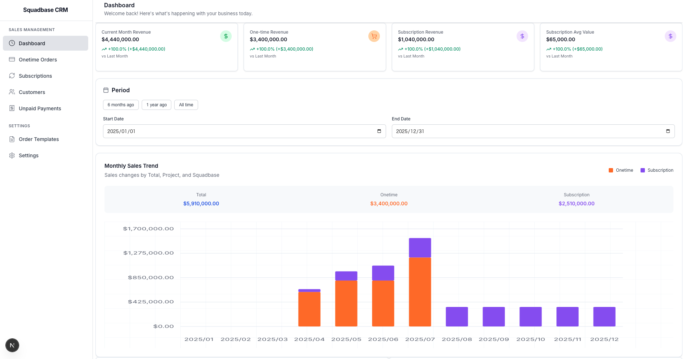

# Squadbase CRM

An open-source Customer Relationship Management (CRM) system designed for easy deployment and customization with Claude Code.



## Vision

CRM systems are essential software tools for any business, yet they are often extremely expensive. Most CRM solutions come with customization limitations or require learning proprietary languages.

That's why we built an open-source, self-hostable CRM system that puts you in control of your data and operations.

### The AI Revolution

Claude Code has made it possible to instantly develop and customize rich applications regardless of your technical stack. Squadbase CRM is designed not only for immediate deployment but also for easy customization using Claude Code, allowing anyone familiar with any technology stack to adapt it to their needs.

While we actively develop this repository, you can easily customize it to build operations perfectly suited to your business. All you need is PostgreSQL - no vendor lock-in, complete data freedom.

PostgreSQL integrates with numerous ETL tools, making it easy to transfer data to other SaaS platforms or data warehouses for analysis. You're never locked into any particular tool.

Updates are as simple as updating the GitHub repository version. Your company data remains completely separate, so you can choose to stay on any version you prefer. No surprise price increases when AI features are added.

The AI revolution is transforming CRM from something you configure to something everyone can build and freely customize. Let's embrace best practices instantly while maintaining self-hosted data and software freedom.

## Deployment

### One-click Deployment

Deploy your own Squadbase CRM instance with a single click. Squadbase automatically provides authentication and access control for secure CRM operations.

[](https://app.squadbase.dev/new/clone?repository-url=https://github.com/squadbase/crm?env-vars=POSTGRES_HOST,POSTGRES_PORT,POSTGRES_USER,POSTGRES_PASSWORD,POSTGRES_DATABASE,LANGUAGE,CURRENCY)

#### PostgreSQL Setup

Squadbase CRM requires only PostgreSQL.

We recommend using Neon for easy and affordable PostgreSQL hosting:
https://neon.com/

Database migrations are handled automatically via commands. For Squadbase's build and deployment environments, allow IP communication to automatically configure the database on Postgres and launch the CRM.

Please configure the following IP addresses:

**Build Server:**
```
54.150.149.0
```

**Deployment Environment:**

After deployment, check the Allow IPs screen and add them to your PostgreSQL IP address whitelist.
[Details here.](https://www.squadbase.dev/en/docs/features/fixed-ip-addresses)


### Environment Variables

Configure the following environment variables during deployment:

```bash
POSTGRES_HOST=localhost
POSTGRES_PORT=5432
POSTGRES_USER=postgres
POSTGRES_PASSWORD=password
POSTGRES_DATABASE=crm_db

LANGUAGE=en # Default: en
CURRENCY=usd # Default: usd
```

#### Supported Languages
- `en` - English
- `ja` - Japanese (日本語)
- `es` - Spanish (Español)
- `fr` - French (Français)
- `zh` - Chinese (中文)
- `ko` - Korean (한국어)

#### Supported Currencies
- `usd` - US Dollar ($)
- `jpy` - Japanese Yen (¥)
- `eur` - Euro (€)
- `cny` - Chinese Yuan (¥)
- `krw` - Korean Won (₩)

**Need additional language or currency support?** Please [open an issue](https://github.com/squadbase/crm/issues) to request new languages or currencies. We welcome community feedback and contributions!

## Setup & Development

This project is built with Next.js.

```bash
npm install
```

Start the local development server:

```bash
npm run dev
```

### Database

The development environment uses docker-compose to install PostgreSQL. Use the following commands for database operations:

```bash
npm run db:up       # Start database
npm run db:down     # Stop database
npm run db:restart  # Restart database
npm run db:migrate  # Run migrations
npm run db:seed     # Insert seed data
```

### Using Claude Code

Set up Claude Code to start using the system immediately.

**MCP Servers in use:**
- Playwright
- Context7

#### Claude Code Commands

Use these custom slash commands to build databases following unified rules:

```bash
/project:db:spec    # Build database specifications (docs/database.md)
/project:db:define  # Build database table definitions (src/lib/db/schema.ts)
/project:db:migrate # Run migrations (drizzle-kit migrate)
```

## Technology Stack

- **Next.js v15** - React framework with App Router
- **TailwindCSS v4** - Utility-first CSS framework
- **shadcn/ui** - Component library
- **Drizzle ORM** - Type-safe database toolkit
- **PostgreSQL** - Database

## Features

- Customer management
- Order tracking
- Subscription management
- Revenue analytics
- Multi-language support (English, Japanese, Spanish, French, Chinese, Korean)
- Multi-currency support (USD, JPY, EUR, CNY, KRW)
- Self-hosted deployment
- Claude Code integration for easy customization

## License

Apache License 2.0